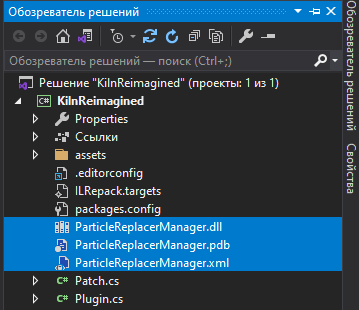

# ParticleReplacerManager

[]()

Just a Frogger manager that easily solves problems with particle materials

Allows you to easily fix the shaders of particle systems.<br>
It also automatically repairs the smoke shader by setting the shader of all objects using the Smoke.cs script to Custom/Lit.<br>
You can easily disable this function by writing this line: ```ParticleReplacer.fixSmoke = false;```<br>
It also has a function for very easy correction of ship effects in 1 line - See example.
The manager also has documentation for each function and each variable used there. To see it, you need to add ```ParticleReplacerManager.pdb``` and ```ParticleReplacerManager.xml``` files to your project.<br>
 <br>

### Merging the DLLs into your mod
Download the ParticleReplacerManager.dll from the release section to the right. Including the DLLs is best done via ILRepack (https://github.com/ravibpatel/ILRepack.Lib.MSBuild.Task). You can load this package (ILRepack.Lib.MSBuild.Task) from NuGet.

If you have installed ILRepack via NuGet, simply create a file named ILRepack.targets in your project and copy the following content into the file

```xml
<?xml version="1.0" encoding="utf-8"?>
<Project xmlns="http://schemas.microsoft.com/developer/msbuild/2003">
    <Target Name="ILRepacker" AfterTargets="Build">
        <ItemGroup>
            <InputAssemblies Include="$(TargetPath)" />
            <InputAssemblies Include="$(OutputPath)\ParticleReplacerManager.dll" />
        </ItemGroup>
        <ILRepack Parallel="true" DebugInfo="true" Internalize="true" InputAssemblies="@(InputAssemblies)" OutputFile="$(TargetPath)" TargetKind="SameAsPrimaryAssembly" LibraryPath="$(OutputPath)" />
    </Target>
</Project>
```

Make sure to set the ParticleReplacerManager.dll in your project to "Copy to output directory" in the properties of the DLLs and to add a reference to it. 
After that, simply add ```using ParticleReplacerManager;``` to your mod and use the ```ParticleReplacer``` class, to fix your particles.

### Example project
This adds new kiln and fixing its particles.

```csharp
using BepInEx;
using HarmonyLib;
using PieceManager;
using ParticleReplacerManager;

namespace ParticleReplacerExample
{
    [BepInPlugin(ModGUID, ModName, ModVersion)]
    public class Plugin : BaseUnityPlugin
    {
        internal const string ModName = "Frogger-ParticleReplacerExample", ModVersion = "0.0.1", ModGUID = "com.Frogger.ParticleReplacerExample";
        internal static Plugin _self;
        internal static Harmony harmony = new(ModGUID);

        private void Awake()
        {
            _self = this;

            BuildPiece piece = new("kiln", "JF_KilnReimagined");
            piece.RequiredItems.Add("Stone", 20, true);
            piece.RequiredItems.Add("SurtlingCore", 5, true);
            piece.Crafting.Set(CraftingTable.Workbench);
            piece.Category.Add(BuildPieceCategory.Crafting);
            MaterialReplacer.RegisterGameObjectForShaderSwap(piece.Prefab, MaterialReplacer.ShaderType.UseUnityShader);

            ParticleReplacer.FixSmoke = false;
            ParticleReplacer.ShipFixingDebuging = false;
            //If your ship is not fully fixed, enable this option. 
            //If the effects in your ship are called the same as in the original ships, then you should have 8 messages for each ship

            ParticleReplacer.RegisterParticleSystemForShaderSwap(
                piece.Prefab, //Prefab of a ParticleSystem or any other prefab having them inside itself.
                ParticleReplacer.ShaderType.LitParticles, //The shader to be applied to the material of the particles.
                "_enabled/flames"); //The path where the particulars are located inside the prefab.
                                //Leave it unchanged if the ParticleSystem component is on the prefab itself.
            ParticleReplacer.RegisterParticleSystemForShaderSwap(piece.Prefab, ParticleReplacer.ShaderType.LitParticles, "_enabled/smoke (1)");
            ParticleReplacer.RegisterParticleSystemForShaderSwap(piece.Prefab, ParticleReplacer.ShaderType.LitParticles, "_enabled/smok_small");
            ParticleReplacer.RegisterParticleSystemForShaderSwap(piece.Prefab, ParticleReplacer.ShaderType.LitParticles, "_enabled/smok_small (1)");
            ParticleReplacer.RegisterParticleSystemForShaderSwap(piece.Prefab, ParticleReplacer.ShaderType.LitParticles, "_enabled/flare");

            ParticleReplacer.RegisterParticleSystemForShaderSwap(
            "kiln", //The name of the AssetBundle inside which the effect prefab is located.
            "SomeCustomEffect", //The name of the effect prefab, inside the AssetBundle.
                ParticleReplacer.ShaderType.LitParticles); //The shader to be applied to the material of the particles.

            BuildPiece ship = new("shippy", "JF_Shippy");
            ship.Name
                .English("Shippy")
                .Russian("Кораблик");
            ship.Crafting.Set(CraftingTable.Workbench);
            piece.RequiredItems.Add("Wood", 15, true);
            ship.Category.Add(BuildPieceCategory.Misc);

            ParticleReplacer.FixShip(ship.Prefab); //Just pass your ship GameObject here
            harmony.PatchAll();
        }
    }
}
```
